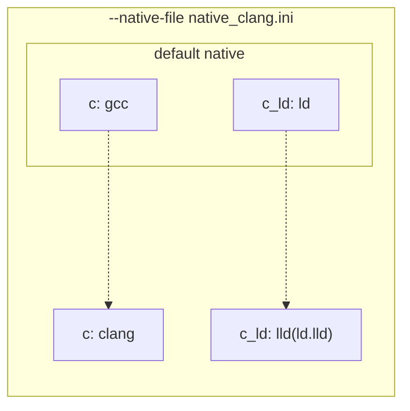
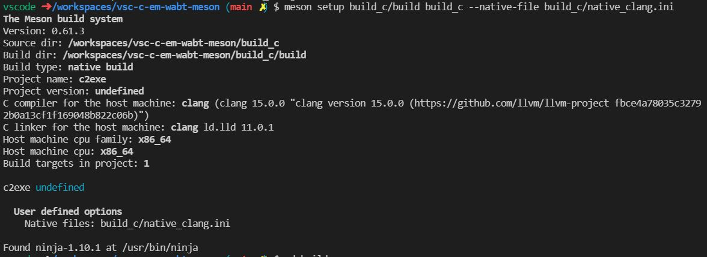

# vsc-c-em-wabt-meson

Docker Iamge for development environment of C/C++, [Emscripten](https://emscripten.org/), [WABT](https://github.com/WebAssembly/wabt) and [Meson](https://mesonbuild.com/) on Dcoker and VSCode RemoteContainer

## Image info

- base image: [mcr.microsoft.com/vscode/devcontainers/cpp](https://github.com/microsoft/vscode-dev-containers/blob/v0.217.4/containers/cpp/.devcontainer/Dockerfile)
    - based on OS:Debian 11
- image size: 2.97 GB


## installed packages/tools

- gcc/clang
- llvm/lld
- [emscripten](https://github.com/emscripten-core/emsdk/blob/main/docker/Dockerfile)
    - Node.js installed with emscripten
- [WABT](https://github.com/WebAssembly/wabt) (wasm2wat, etc)
- Meson(building tool)
    - ninja-builld
- python3, python3-pip (for installing Meson)

## VScode Extensions

- [Microsoft, "C/C++ Extension Pack",
id: `ms-vscode.cpptools-extension-pack`](https://marketplace.visualstudio.com/items?itemName=ms-vscode.cpptools-extension-pack)
- [WebAssembly Foundation, "WebAssembly ", id: `dtsvet.vscode-wasm`](https://marketplace.visualstudio.com/items?itemName=dtsvet.vscode-wasm)

## Example: How to switch compiler and linker on Meson to `clang` and `lld`(ld.lld)



create `native_clang.ini`:

```ini
[binaries]
c='clang'
c_ld='lld'
cpp='clang++'
cpp_ld='lld'
```

`meson setup <build dir> <source dir> --native-file native_clang.ini` on termial:

```bash
$ meson setup build_c/build build_c --native-file build_c/native_clang.ini
```

result: 



meson have been able to switched to `clang` and `lld` as bellow:

```
C compiler for the host machine: clang (clang 15.0.0 "clang version 15.0.0 (https://github.com/llvm/llvm-project fbce4a78035c32792b0a13cf1f169048b822c06b)")
C linker for the host machine: clang ld.lld 11.0.1
```

## TIPS

- project's patterns how to write Meson's `meson.build` file: https://mesonbuild.com/Users.html
